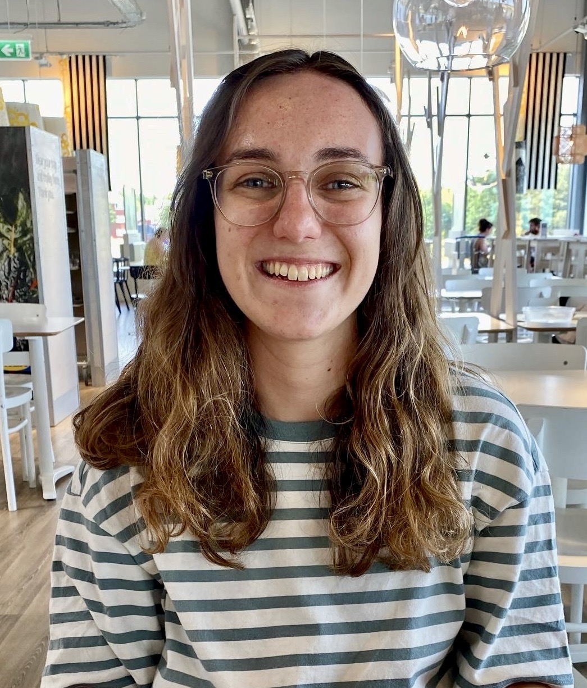

Hello and welcome to my little corner of the internet!

I am a first-year theoretical physics PhD student at the University of Exeter. My research is in the field of quantum thermodynamics, specifically developing a quantum thermodynamical theory for driven and heated spin systems under the supervision of Dr Simon Horsley and Prof. Janet Anders. You can find the group page [here](http://www.quantum-exeter.co.uk/).

